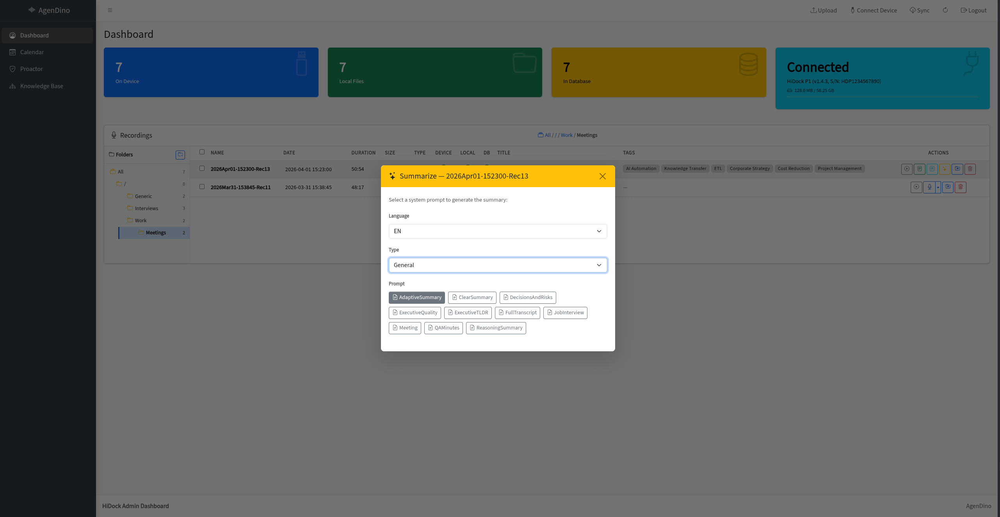

# AI Providers

AgenDino can use **Google Gemini** and/or **DeepSeek** for the AI features that
generate text: summaries, task extraction, daily recaps, knowledge-base Q&A and
AI mind maps. Transcription uses Gemini or local Whisper (see
[Transcription](transcription.md)); embeddings for the knowledge base always use
Gemini.



---

## Configuration

```env
# Default provider for summaries and AI activities: gemini or deepseek
AI_PROVIDER=gemini

# Google Gemini (transcription, embeddings, and optional text generation)
GEMINI_API_KEY=your-gemini-api-key
GEMINI_MODEL=gemini-3.8-flash
GEMINI_EMBEDDING_MODEL=gemini-embedding-2

# DeepSeek (text generation: summaries, tasks, recap, RAG answers)
DEEPSEEK_API_KEY=sk-...
DEEPSEEK_MODEL=deepseek-flash
DEEPSEEK_BASE_URL=https://api.deepseek.com
DEEPSEEK_MAX_TOKENS=32768
DEEPSEEK_THINKING=disabled
```

You only need the keys for the providers you intend to use:

| Goal | Required keys |
|------|---------------|
| Gemini transcription + Gemini AI | `GEMINI_API_KEY` |
| Local Whisper transcription + DeepSeek AI | `DEEPSEEK_API_KEY` |
| Everything | both |

Starting the app with only `DEEPSEEK_API_KEY` is supported: transcription and
knowledge-base loading are simply unavailable until a Gemini key is added.

## Choosing a provider

- `AI_PROVIDER` sets the default. If it is left empty, AgenDino picks Gemini
  when a Gemini key is present, otherwise DeepSeek.
- The dashboard, calendar and knowledge pages expose a provider picker next to
  AI actions, so you can override the default per request.

## DeepSeek options

| Variable | Default | Description |
|----------|---------|-------------|
| `DEEPSEEK_MODEL` | `deepseek-flash` | Model name |
| `DEEPSEEK_BASE_URL` | `https://api.deepseek.com` | OpenAI-compatible endpoint |
| `DEEPSEEK_MAX_TOKENS` | `32768` | Output token budget (max 393216) |
| `DEEPSEEK_THINKING` | `disabled` | `enabled`, `disabled`, or `default`. Thinking tokens share the output budget, so it is off by default to avoid truncating long JSON responses. |

## Failure handling

DeepSeek requests are retried with exponential backoff on transient failures
(HTTP 408/425/429/5xx and network timeouts) before the request is reported as
failed.

---

**Related:** [Summarization](summarization.md) · [Task Generation](task-generation.md) · [Daily Recap](daily-recap.md) · [Knowledge Base](knowledge-base.md)
