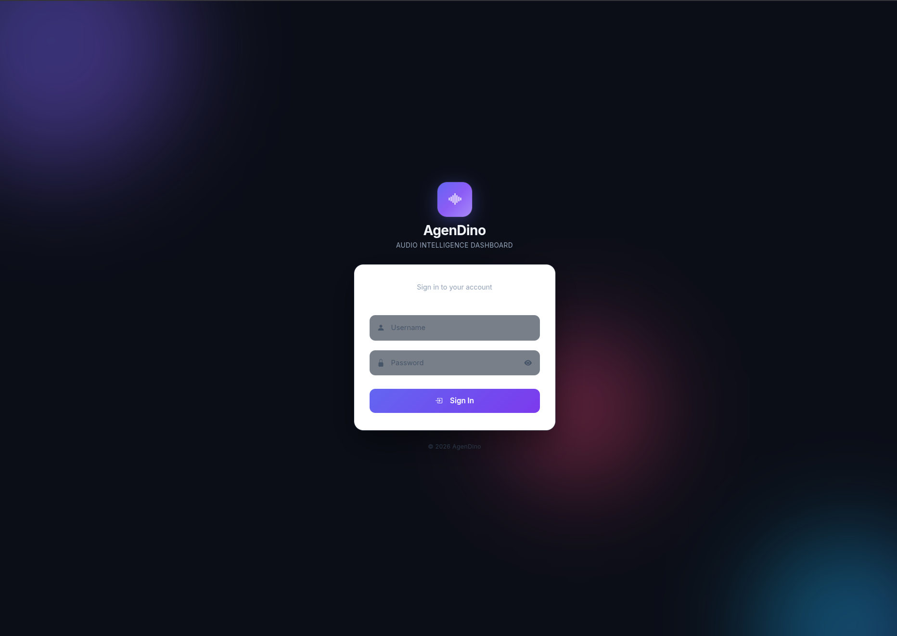

# Authentication

Optional single-user login system with session cookies and IP banning.

<!-- TODO: Add screenshot -->


---

## Overview

Authentication is **disabled by default**. When enabled, all routes require a valid session cookie, and the first login creates the permanent account.

## Enabling Authentication

Set `AUTH_ENABLED=true` in your `.env` file:

```env
AUTH_ENABLED=true
```

## How It Works

### First Login (Account Creation)

1. Navigate to the dashboard - you'll be redirected to the **login page**.
2. Enter your desired **username** and **password**.
3. These credentials are stored as the permanent account:
   - Password is hashed with **PBKDF2-SHA256** (200,000 iterations).
   - Credentials are saved in `settings/auth.json`.

> **Important:** There is no built-in password reset. Choose your credentials carefully. To start over, delete `settings/auth.json`.

### Subsequent Logins

- Credentials are verified against the stored hash.
- On success, a session cookie (`agendino_session`) is issued, valid for **7 days**.
- Browser requests without a valid session are redirected to the login page.
- API requests without a valid session receive a `401` response.

### Failed Login Protection

- A failed login attempt **permanently bans** the client's IP address.
- All future requests from that IP are blocked with `403 Forbidden`.
- Banned IPs are stored in `settings/banned_ips.json`.

### Unbanning an IP

Edit or delete `settings/banned_ips.json` to remove a banned IP address.

### Logout

- Destroys the session server-side.
- Clears the session cookie.

## Security Notes

| Aspect | Implementation |
|--------|---------------|
| Password hashing | PBKDF2-SHA256, 200K iterations |
| Session storage | Server-side, cookie-based |
| Session expiry | 7 days |
| IP banning | Permanent on first failed attempt |
| Credential storage | `settings/auth.json` |

---

**Related:** [Getting Started](getting-started.md)
