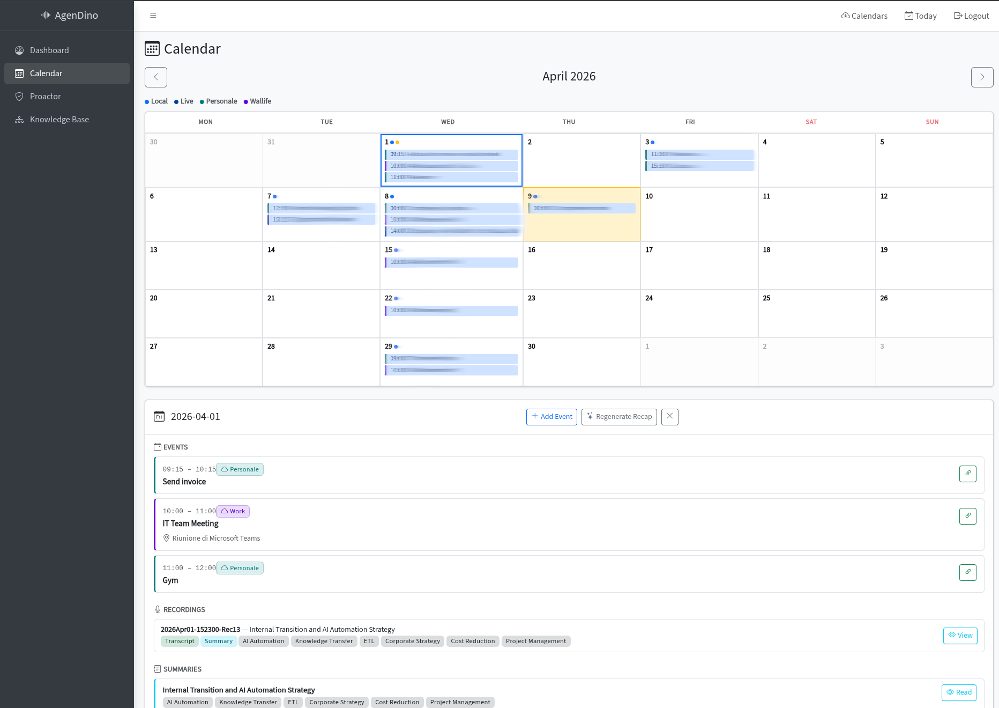

# Calendar

Built-in calendar with manual events, shared calendar subscriptions (iCal), and recording-event linking.

<!-- TODO: Add screenshot -->

---

## Overview

The Calendar page provides a monthly calendar view with support for manual events, external calendar subscriptions, and the ability to link recordings to events for meeting context.

## Manual Events

### Creating Events

1. Navigate to the **Calendar** page from the sidebar.
2. Click on a date or use the **Create Event** button.
3. Fill in event details:
   - **Title** (required)
   - **Start / End time**
   - **Description**
   - **Location**
   - **Meeting URL**
4. Save the event.

### Editing & Deleting

- Click an event to open its detail view.
- Edit any field inline.
- Delete events you no longer need.

## Linking Recordings to Events

Associate recordings with calendar events to keep meeting notes connected to the schedule:

1. From the day detail panel, click **Link Recording** on an event.
2. Select a recording from the picker.
3. The recording (and its transcripts/summaries) are now associated with that event.
4. Unlink at any time.

## Day Detail Panel

Click any date to open a **day detail panel** showing:
- All **events** for that date (manual + shared calendar).
- All **recordings** from that date.
- All **summaries** generated for those recordings.
- The **daily recap** (if generated).

## Shared Calendars (iCal Sync)

Subscribe to external calendars via iCal URL to see events from Google Calendar, Outlook, and other providers.

### Adding a Shared Calendar

1. Open the shared calendars panel from the Calendar page.
2. Paste an **iCal URL** (e.g. a Google Calendar secret address or Outlook ICS link).
3. The URL is **validated** before subscribing - helpful hints are shown if the URL points to a login page instead of calendar data.
4. Set a **sync interval** (default: 30 minutes).
5. Assign a **custom color** for visual distinction.

### Sync Behavior

- Calendars auto-sync when the interval elapses.
- Click **Sync** to refresh manually.
- **Recurring events** are expanded automatically (±3 months window).
- Supported event properties:
  - All-day events
  - Event status (confirmed / tentative / cancelled)
  - Locations and meeting URLs
  - Recurring event rules (RRULE)

### Managing Shared Calendars

- **Edit** - change sync interval, color, or URL.
- **Delete** - remove the subscription and all its synced events.
- **Sync individually** or **sync all** calendars at once.

---

**Related:** [Daily Recap](daily-recap.md) · [Proactive Schedule Analysis](proactive-analysis.md)
