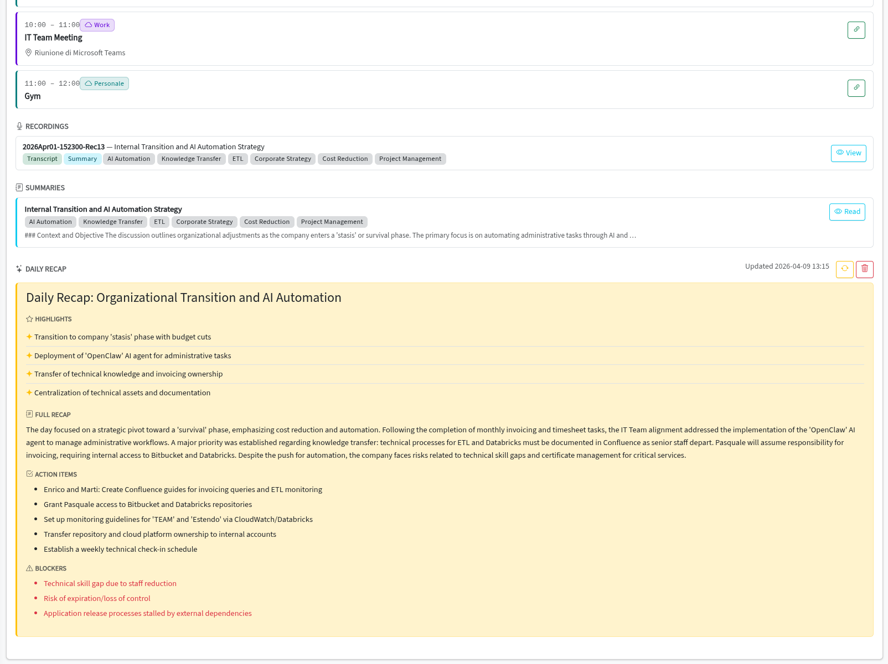

# Daily Recap

Generate an AI-powered end-of-day narrative from all calendar events and meeting summaries for a given date.



---

## Overview

The Daily Recap feature uses Gemini to produce a structured end-of-day summary that combines all calendar events and meeting summaries into a single cohesive narrative.

## How It Works

1. From the Calendar **day detail panel**, click **Generate Recap** for any date.
2. Gemini receives all events and meeting summaries for that day.
3. The generated recap includes:
   - **Title** - a descriptive title for the day.
   - **Key highlights** - the most important takeaways.
   - **Full narrative** - a markdown document summarizing the entire day.
   - **Action items** - tasks and follow-ups extracted from the day's activities.
   - **Blockers** - any issues or obstacles identified.

## Recap Structure

```markdown
## Title
"Productive Sprint Planning and Client Alignment"

## Key Highlights
- Sprint 12 scope finalized with 23 story points
- Client approved the new dashboard design
- Infrastructure migration timeline confirmed

## Narrative
[Full markdown narrative covering the day's events...]

## Action Items
- Schedule follow-up with design team
- Update Jira board with sprint scope

## Blockers
- CI/CD pipeline needs GPU runner for ML tests
```

## Managing Recaps

- Recaps are saved to the database and can be viewed from the day detail panel.
- **Regenerate** - create a new recap (replaces the previous one).
- **Delete** - remove the recap for a date.

---

**Related:** [Calendar](calendar.md) · [Summarization](summarization.md)
