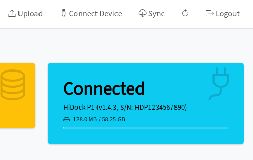

# HiDock USB Integration

Connect and sync recordings directly from HiDock H1, H1E, and P1 devices over USB.

---

## Overview

AgenDino detects HiDock devices connected via USB and lets you interact with them directly from the web dashboard - no companion app required.

## Supported Devices

| Device | USB Vendor ID | Status |
|--------|--------------|--------|
| HiDock H1 | `10d6` | ✅ Supported |
| HiDock H1E | `10d6` | ✅ Supported |
| HiDock P1 | `10d6` | ✅ Supported |

## Features

- **Auto-detection** - the dashboard detects connected HiDock devices automatically when you interact with device features.
- **List recordings** - browse all recordings stored on the device.
- **Download recordings** - transfer recordings from the device to local storage.
- **Delete recordings** - remove recordings from the device after syncing.
- **Device info** - view device model, firmware version, and storage usage.

## Syncing Recordings

1. Connect your HiDock device via USB.
2. From the dashboard, click **Sync** to download new recordings from the device to local storage and register them in the database.
3. Recordings already present locally are skipped automatically.

## USB Permissions (Linux)

On Linux, you need a udev rule to access the device without root privileges. See [Getting Started](getting-started.md#4-usb-permissions-linux-only) for setup instructions.

## Troubleshooting

| Issue | Solution                                                                                                     |
|-------|--------------------------------------------------------------------------------------------------------------|
| Device not detected | Check USB connection, try a different port or confirm is not already connected to other webpage like hinotes |
| Permission denied | Add the udev rule (Linux) or run with appropriate permissions                                                |
| Sync stalls | Disconnect and reconnect the device, then retry                                                              |

---

**Related:** [Recording Management](recording-management.md) · [Getting Started](getting-started.md)
