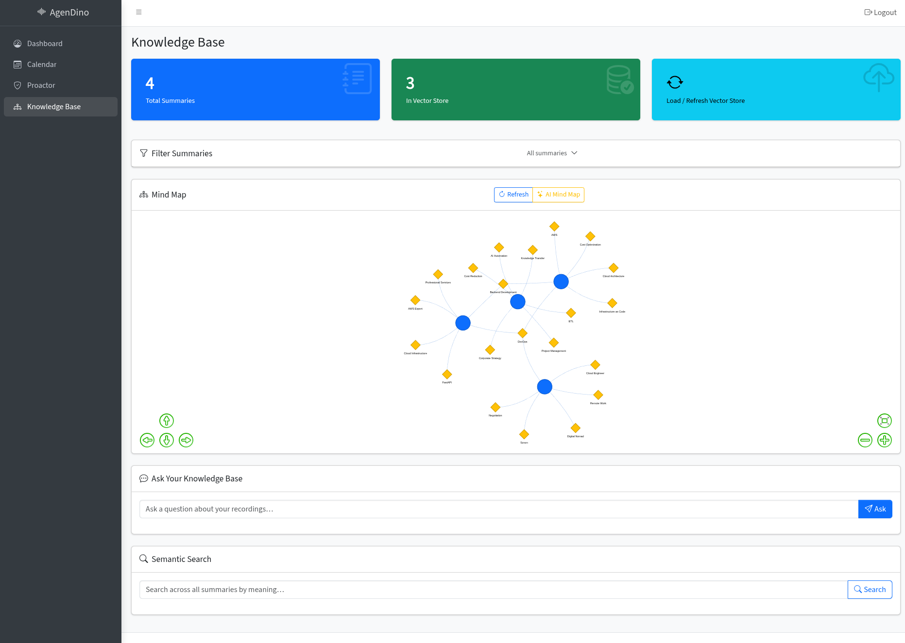
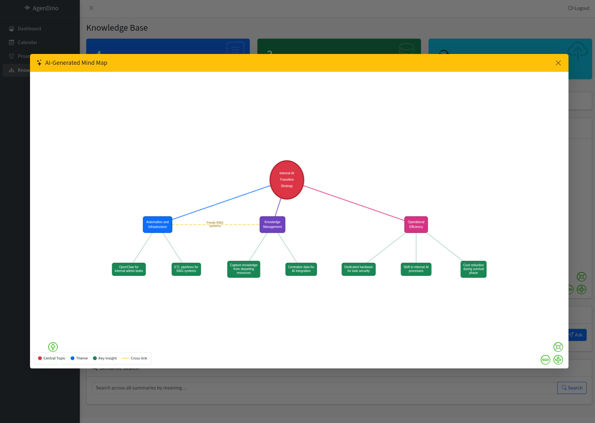

# Knowledge Base & Mind Map

Retrieval-Augmented Generation (RAG) for searching and querying your meeting knowledge, plus interactive mind maps.

<!-- TODO: Add screenshot -->

---

## Overview

The Knowledge page lets you load all your summaries into a local vector store (ChromaDB with Gemini embeddings), then search or ask natural-language questions across your entire meeting knowledge base. It also includes an interactive mind map for visualizing connections between summaries.

## Setup

1. Navigate to the **Knowledge** page from the sidebar.
2. Click **Load Summaries** to index all summaries into the ChromaDB vector store.
3. This creates Gemini embeddings for each summary and stores them locally in `settings/vector_store/`.

## Semantic Search

Use **Search** to find content across all indexed summaries by meaning, not just keywords.

- Enter a natural-language query.
- Results are ranked by semantic similarity.
- Each result links back to the source summary.

## Question Answering (RAG)

Use **Ask** to pose natural-language questions:

1. Type your question (e.g. "What decisions were made about the migration timeline?").
2. Relevant summary chunks are retrieved from the vector store.
3. Gemini answers based on the retrieved context.
4. The response includes **source citations** with links back to the original summaries.

## Filtering

Optionally filter queries to specific summaries using the **summary picker**. This narrows the search scope when you're looking for information from a particular meeting.

## Clearing the Vector Store

Click **Clear** to reset the vector store and re-index from scratch. Useful after deleting or regenerating summaries.

---

## Mind Map

Visualize connections across summaries as an interactive graph.

<!-- TODO: Add screenshot -->

### Tag-Based Mode (Default)

- Generates a graph **instantly** - no AI call needed.
- Summary nodes connect to shared tag nodes.
- Great for a quick overview of topic clusters.

### AI-Generated Mode

- Gemini analyzes all summaries and produces a **hierarchical map**:
  - Central topic
  - 3–7 thematic branches
  - Key insights as leaf nodes (with source summary IDs)
  - Cross-cutting connections between themes

---

**Related:** [Summarization](summarization.md) · [Daily Recap](daily-recap.md)
