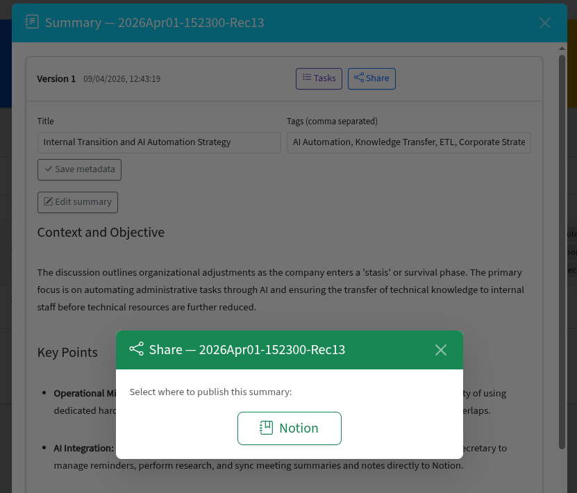

# Notion Publishing

Publish summaries as rich sub-pages under a Notion parent page.

<!-- TODO: Add screenshot -->


---

## Overview

AgenDino can publish summaries directly to Notion, creating formatted sub-pages with metadata, tags, and the full markdown summary content.

## Prerequisites

1. Create a [Notion integration](https://www.notion.so/my-integrations) and copy the **API key**.
2. Share a Notion page with your integration and copy its **page ID**.
3. Add both to your `.env` file:

```env
NOTION_API_KEY=your-notion-integration-token
NOTION_PAGE_ID=your-notion-parent-page-id
```

## Publishing a Summary

1. After summarizing a recording, click **Publish** on the summary version you want to share.
2. Select **Notion** as the destination.
3. A new sub-page is created under your configured parent page containing:
   - **Metadata callout** - recording name, date, duration.
   - **Tags** - displayed as labels.
   - **Formatted summary** - full markdown content rendered as Notion blocks.
4. The Notion page URL is saved in the database for quick access.

## Viewing Published Pages

After publishing, a **link icon** appears next to the summary. Click it to open the Notion page directly in your browser.

---

**Related:** [Summarization](summarization.md)
