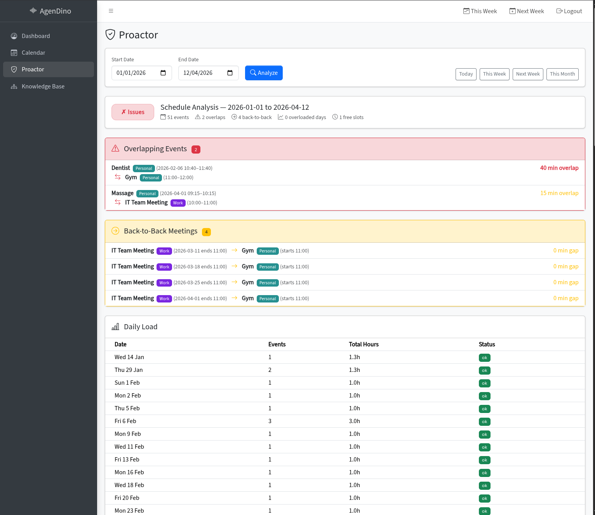

# Proactive Schedule Analysis

Analyze your calendar for scheduling issues across a date range with visual timelines and a health score.

<!-- TODO: Add screenshot -->

---

## Overview

The Proactor page runs a local analysis (no AI call) across a date range to detect scheduling problems and provide actionable insights. It includes visual day timelines and an overall schedule health score.

## How It Works

1. Navigate to the **Proactor** page from the sidebar.
2. Select a **date range** (start and end date).
3. Click **Analyze**.
4. The analysis runs entirely locally and returns results instantly.

## Detected Issues

### Overlapping Events

Events that share time slots, categorized by severity:

| Severity | Overlap Duration |
|----------|-----------------|
| 🟢 Low | < 15 minutes |
| 🟡 Medium | 15–60 minutes |
| 🔴 High | > 60 minutes |

### Back-to-Back Meetings

Consecutive events with **less than 5 minutes** between them. These leave no buffer for context switching or breaks.

### Free-Slot Gaps

Time between events, classified as:
- **Short** - brief gaps that are hard to use productively.
- **Available** - useful windows for focused work.
- **Idle** - extended free periods.

### Overloaded Days

Days with **more than 6 hours** of total meeting time.

## Visual Day Timelines

Each analyzed day shows a **visual timeline** with:
- Meeting blocks (color-coded by calendar source).
- Free slots between meetings.
- Percentage-based widths reflecting actual duration.

## Health Score

An overall **schedule health score** is calculated from the total issue count:

| Score | Meaning |
|-------|---------|
| ✅ Good | Few or no issues detected |
| ⚠️ Fair | Some scheduling concerns |
| 🔴 Poor | Significant scheduling problems |

---

**Related:** [Calendar](calendar.md)
