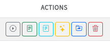
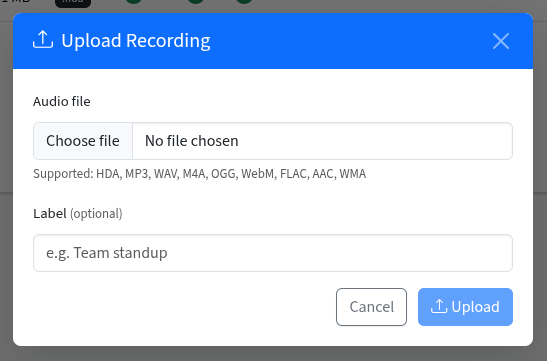
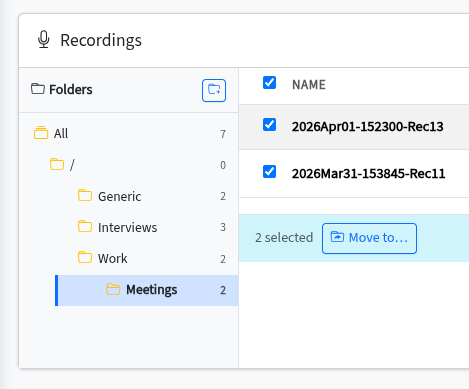
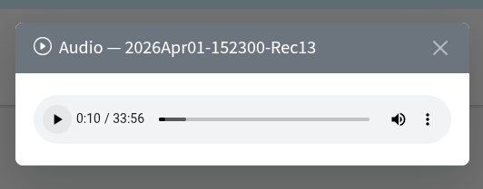
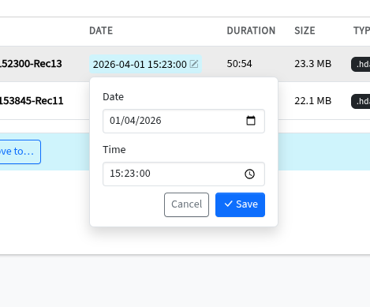
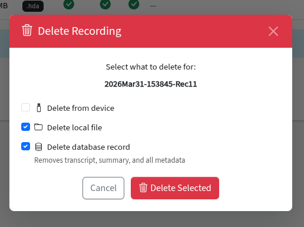

# Recording Management

Upload, organize, play back, and manage audio recordings from the web dashboard.

<!-- TODO: Add screenshot -->

---

## Overview

All recordings - whether synced from a HiDock device or uploaded manually - are stored locally in the `local_recordings/` directory and tracked in the SQLite database. The dashboard provides a full management interface for browsing, playing, organizing, and deleting recordings.

## Supported Audio Formats

| Format | Extension |
|--------|-----------|
| MP3 | `.mp3` |
| WAV | `.wav` |
| M4A | `.m4a` |
| OGG | `.ogg` |
| WebM | `.webm` |
| FLAC | `.flac` |
| AAC | `.aac` |
| WMA | `.wma` |
| HiDock Audio | `.hda` |

## Uploading Audio Files

1. Click the **Upload** button on the dashboard.
2. Select any supported audio file.
3. The file is saved to local storage, a database record is created, and audio duration is automatically extracted via [mutagen](https://github.com/quodlibet/mutagen).
4. Uploaded files can be transcribed and summarized just like device recordings.

## Organizing with Folders

Recordings can be organized into virtual folders for better structure:

- **Create** a folder from the dashboard.
- **Rename** or **delete** folders (recordings in a deleted folder move back to root).
- **Drag and drop** individual recordings into a folder.
- **Bulk move** multiple selected recordings at once.

## Playback

Select any recording to play it back directly in the browser using the built-in audio player. Recordings are streamed from the server.

## Editing Recording Metadata

- Update the **date/time** associated with a recording.
- Recordings are sorted chronologically by default.

## Deleting Recordings

You can selectively delete a recording from:

- **Local storage** - removes the audio file from disk.
- **Database** - removes the metadata, transcript, and summaries.

Each target is independent - you can delete the local file while keeping the database record, or vice versa.

---

**Related:** [HiDock Integration](hidock-integration.md) · [Transcription](transcription.md)
