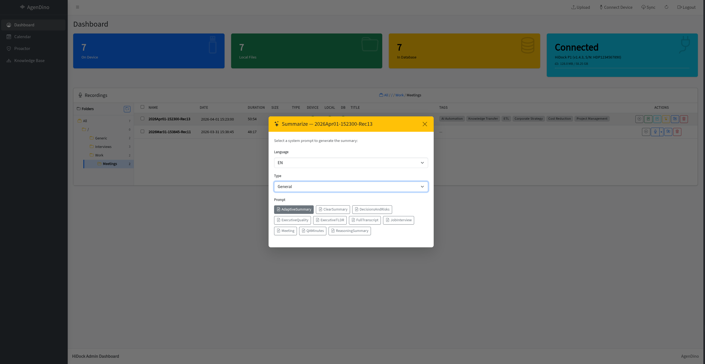

# Summarization

Generate structured AI summaries from transcripts using Google Gemini with customizable system prompts.

<!-- TODO: Add screenshot -->

---

## Overview

Once a recording has been transcribed, you can generate a structured summary using Gemini. Summaries include a **title**, **tags**, and a **full markdown body**. You can create multiple summary versions per recording using different system prompts.

## How It Works

1. Make sure the recording has been transcribed first.
2. Click **Summarize** and choose a **system prompt** from the available categories (e.g. `Generale / SintesiAdattiva`, `IT&Engineering / VerbaleIT`).
3. Gemini generates a structured JSON response containing:
   - **Title** - a concise summary title.
   - **Tags** - relevant keywords for categorization.
   - **Summary** - full markdown content with sections, bullet points, and structure defined by the prompt.
4. The result is saved to the database.

## Multiple Summary Versions

You can re-summarize the same recording with a different prompt at any time. Each summary is saved as a separate version - previous summaries are never overwritten.

This is useful when you want different perspectives on the same meeting (e.g. an executive recap vs. a detailed action tracker).

## Editing Summaries

After generation, you can inline-edit:
- **Title** - click to edit.
- **Tags** - add, remove, or modify tags.
- **Content** - edit the full markdown body.

All changes are saved to the database.

## System Prompts

Summaries are shaped by the system prompt you choose. See [Custom System Prompts](custom-system-prompts.md) for how to add your own.

---

**Related:** [Transcription](transcription.md) · [Task Generation](task-generation.md) · [Custom System Prompts](custom-system-prompts.md)
