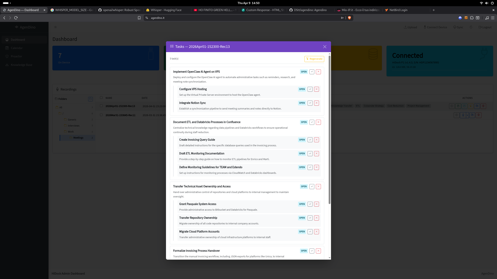

# Task Generation

Automatically extract actionable tasks from meeting summaries using Gemini.

<!-- TODO: Add screenshot -->


---

## Overview

After summarizing a recording, you can generate structured tasks from the summary content. Tasks are modeled as Jira-style tickets with titles and descriptions, and broad tasks are automatically broken into subtasks.

## How It Works

1. After summarizing a recording, click **Generate Tasks** on any summary version.
2. Gemini analyzes the summary and extracts actionable items.
3. Each task includes:
   - **Title** - a concise action item.
   - **Description** - context and details for the task.
   - **Subtasks** - broad tasks are broken down into smaller, actionable steps.
4. Tasks are saved to the database linked to the specific summary version.

## Task Structure

```
Task: Migrate authentication to OAuth2
├── Description: Replace current PBKDF2 login with OAuth2 flow...
├── Status: open
└── Subtasks:
    ├── Research OAuth2 providers
    ├── Implement token refresh logic
    └── Update frontend login flow
```

## Managing Tasks

- **Toggle status** - mark tasks as open or done.
- **Edit** - modify task title and description.
- **Delete** - remove individual tasks.
- **Regenerate** - regenerating tasks for a summary replaces all previous tasks for that summary.

---

**Related:** [Summarization](summarization.md) · [Daily Recap](daily-recap.md)
