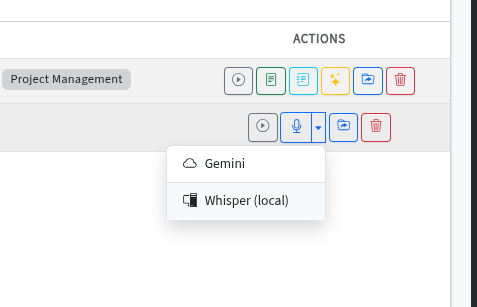

# Transcription

Convert audio recordings to text using cloud-based (Gemini) or local (Whisper) speech-to-text engines.

---

## Overview

AgenDino offers two transcription engines. You can choose between them per recording depending on your needs.

## Engine Comparison

| Feature | Gemini (Cloud) | Whisper (Local) |
|---------|---------------|-----------------|
| **Runs on** | Google Cloud | Your machine |
| **Speaker diarization** | ✅ Automatic | ❌ Not included |
| **Speaker labels** | ✅ Yes | ❌ No |
| **Timestamps** | ✅ Yes | ✅ Yes |
| **Long recordings** | ⚠️ May truncate | ✅ Full transcription |
| **Privacy** | Audio sent to Google | Fully offline |
| **First-use setup** | None | Model download (~500 MB for `small`) |
| **Speed** | Fast (cloud) | Depends on hardware |

## Using Gemini Transcription

1. Select a synced or uploaded recording.
2. Click the **Transcribe** button (microphone icon).
3. Gemini processes the audio and returns a transcript with speaker diarization, labels, and timestamps.
4. The transcript is saved to the database.

## Using Whisper Transcription

1. Select a recording.
2. Click the **dropdown arrow** next to the Transcribe button and choose **Whisper (local)**.
3. On first use, the Whisper model is downloaded automatically.
4. Transcription runs entirely on your machine - no audio is uploaded.

### Whisper Configuration

Configure Whisper via environment variables in `.env`:

| Variable | Default | Options |
|----------|---------|---------|
| `WHISPER_MODEL_SIZE` | `small` | `tiny`, `base`, `small`, `medium`, `large-v3` |
| `WHISPER_DEVICE` | `cpu` | `cpu`, `cuda` (requires NVIDIA GPU + CUDA toolkit) |
| `WHISPER_COMPUTE_TYPE` | `auto` | `auto`, `int8`, `float16`, `float32` |

Larger models produce better accuracy but require more RAM and processing time. The `small` model is a good balance for most use cases.

## Editing Transcripts

After transcription, you can edit the transcript text directly from the dashboard. Changes are saved to the database.

---

**Related:** [Summarization](summarization.md) · [Recording Management](recording-management.md)
